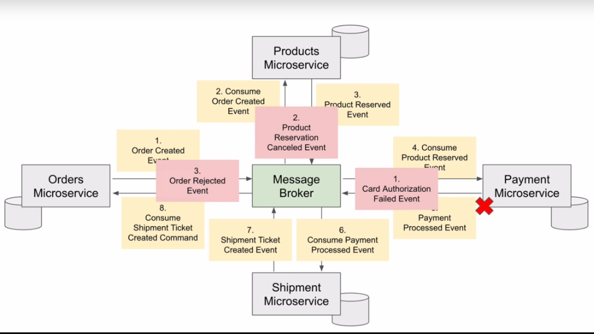

= Event-Driven Microservices, CQRS, SAGA, Axon with Spring Boot and Apache Camel

== Links
- https://camel.apache.org/components/3.15.x/eips/saga-eip.html[SAGA Apache Camel]
- https://www.axoniq.io/[Axon Framework]

== Distributed Microservices & Transactions

. Eureka Discovery Service
. Spring Cloud API Gateway
. Axon Framework
. CQRS & Event architecture
. Event-Driven architecture
. Validation, Error Handling and Transaction Rollback in CQRS
. Saga design pattern & distributed transactions

== Microservices vs Monolithic

. Microservice small and responsible for one thing, configured to work in the Cloud and is easily scalable

.Microservices Representation

== Transaction in Microservices

. ACID Transactions in Monolithic
. Microservice architecture we have each micro is a separated app with this own database/schema, SAGA is a design pattern to keep consistence between microservices, we have to possibilities
.. Choreography-Based: Message Broker centralizing exchange events to complete the success, in case of failures compensation operations/transaction need be performed
.. Orchestration-Based Specific Microservice that explicit Manage a SAGA pipeline, down bellow an Apache Camel SAGA sample using LRA
.. All compensation operations need be used in reversed order

[source, xml]
----
<dependency>
 <groupId>org.apache.camel</groupId>
 <artifactId>camel-lra</artifactId>
 <!-- use the same version as your Camel core version -->
 <version>x.y.z</version>
</dependency>
----

Suppose you want to place a new order, and you have two distinct services in your system: one managing the orders and one managing the credit. Logically you can place an order if you have enough credit for it.

With the Saga EIP you can model the direct:buy route as a Saga composed of two distinct actions, one to create the order and one to take the credit. Both actions must be executed, or none of them: an order placed without credit can be considered an inconsistent outcome (and a payment without an order).

[source, java]
----
class MyRouter extends RouteBuilder {
  @Override
  public void configure() {
    from("direct:buy")
      .saga()
        .to("direct:newOrder")
        .to("direct:reserveCredit");

    from("direct:newOrder")
      .saga()
        .propagation(SagaPropagation.MANDATORY)
          .compensation("direct:cancelOrder")
        .transform().header(Exchange.SAGA_LONG_RUNNING_ACTION)
        .bean(orderManagerService, "newOrder")
        .log("Order ${body} created");

    from("direct:cancelOrder")
      .transform().header(Exchange.SAGA_LONG_RUNNING_ACTION)
      .bean(orderManagerService, "cancelOrder")
      .log("Order ${body} cancelled");

  }
}
----

.SAGA Choreography Compensation actions

.SAGA Orchestration Compensation actions

== Frameworks

. Eventuate
. Axon

== Command-Query Responsibility Segregation

. Commands - createSomething(Product p) / POST, PUT, DELETE and PATCH
. Query - findSomething(String id) / GET
